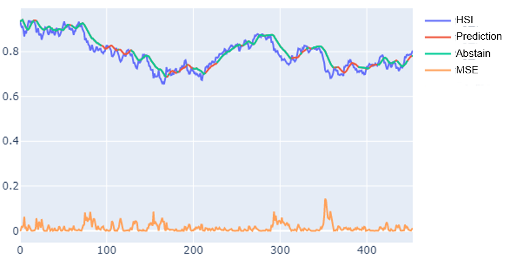

# SelectiveTs

> Predicting Time-series Selectively

SeletiveTs is strongly inspired by the architecture of SelectiveNet, and is able to learn the instrinstic patterns of a financial market without user-specified abstaining threshold.


## Results

> General Results on DAX, S&P 500 and HSI.




_Raw data retrieved from Yahoo Finance_

## Run

Simply run:
```
python examples/demo.py
```
